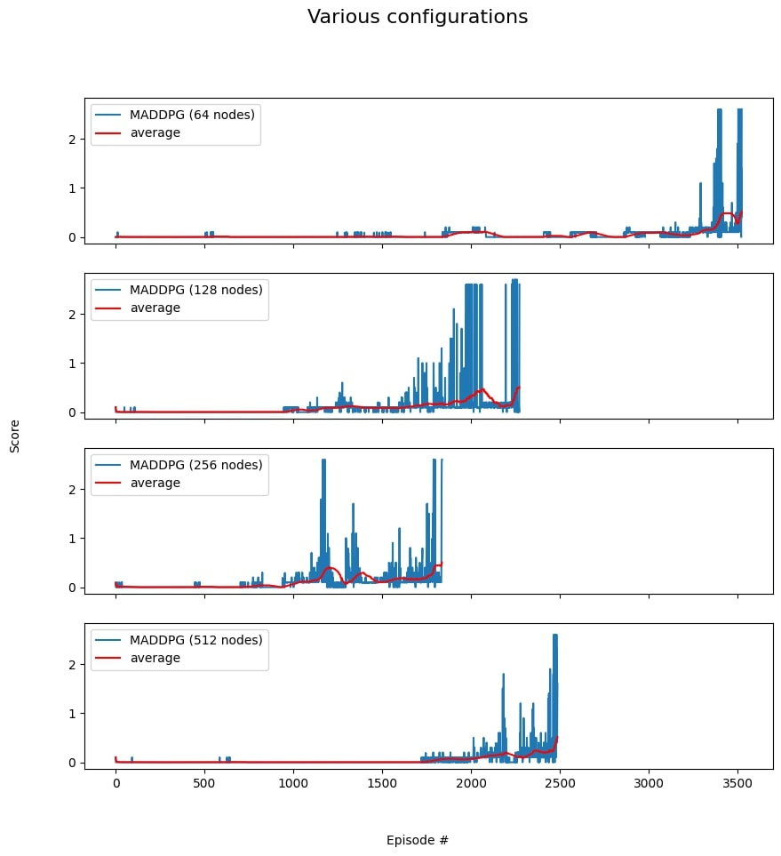
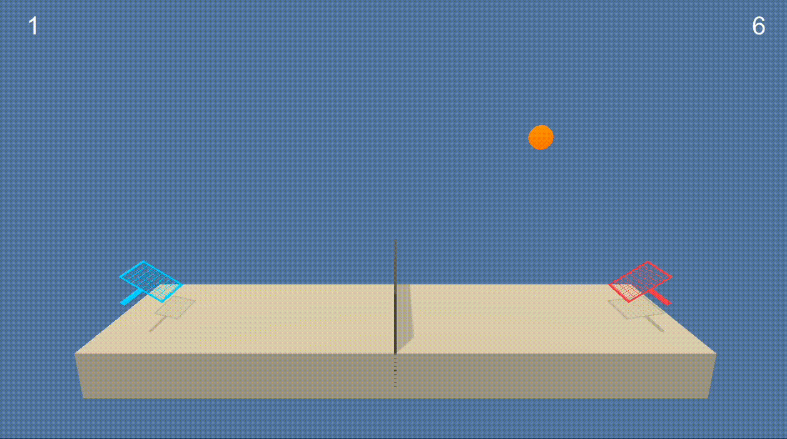

# Udacity Deep RL Project 3 Report: Collaboration and Competition

### Goal

The goal of this assignment was to train two agents, using neural networks, to play tennis. The task is considered solved when a score of 0.5 or more is achieved over 100 consecutive episodes, after taking the maximum over both agents over all agents.

### Environment

In this environment, two agents control rackets to bounce a ball over a net. If an agent hits the ball over the net, it receives a reward of +0.1. If an agent lets a ball hit the ground or hits the ball out of bounds, it receives a reward of -0.01. Thus, the goal of each agent is to keep the ball in play.

The observation space consists of 8 variables corresponding to the position and velocity of the ball and racket. Each agent receives its own, local observation. Two continuous actions are available, corresponding to movement toward (or away from) the net, and jumping.

### Approach

#### Learning Algorithm

MADDPG which is an actor-critic approach was used as the learning algorithm for the agent. This algorithm is derived from DDPG, but manages to solve tasks with multiple agents.

As an off-policy algorithm MADDPG utilizes four neural networks: a local actor, a target actor, a local critic and a target critic Each training step the experience (state, action, reward, next state) the two agents gained was stored. Then every training step the agent learned from a random sample from the stored experience. 

The actor tries to estimate the optimal policy by using the estimated state-action values from the critic while critic tries to estimate the optimal q-value function and learns by using a normal q-learning approach. Using this approach one gains the benefits of value based and policy based methods at the same time. By giving the critic access to the action of the other player the learning process gets stabilized without requiring to give the additional information to the actor which is the only network required for acting after the agent was trained successfully.

#### Model architecture

The architecture of the model was simple. It consisted of two hidden Leaky-ReLu layers. There was a batch normlaization layer before the connected layers. The input layer had the dimension 24x1 for the 24 different state spaces. Next, there were two fully connected layers with the number of nodes kept the same and adjustable.

#### Hyperparameters

| Hyperparameter | Value |
| -------------- | ----- |
| γ (Discount factor) | 0.99 |
| τ | 1e-3  |
| Learning rate (actor) | 1e-4 |
| Learning rate (critic) | 1e-3 |
| Replay buffer size | 1e5 |
| Batch size | 128 |
| L2 weight decay | 0 |
| Max number of episodes | 500 |

### Results

4 different configurations were run. The number of nodes was changed. The table below is the output from running all the configurations.

| Configuration | Number of episodes to solve | Average Score |
| ------------- | --------------------------- | ------------- |
| MADDPG (64 nodes) | 3524 | 0.5170 |
| MADDPG (128 nodes) | 2273 | 0.5087 |
| MADDPG (256 nodes) | 1837 | 0.5055 |
| MADDPG (512 nodes) | 2487 | 0.5153 |

The image below is the plots for each of the configurations.

### Conclusion

The more nodes that were added, the faster the agent solved the environment unitl it got more than 256 modes. The best agent was DDPG with 256 nodes.

GIF of the best performing agent

As can be seen from the GIF above, the agent doesn't really perform the task well even though it has all the requirements. Some further investigation will be needed to get it to perform better.

### Future Improvements

* Try more nodes and investigate the effects and time to train
* Try models with more layers
* Implement Prioritized Experience Replays
* Optimize hyperparameters